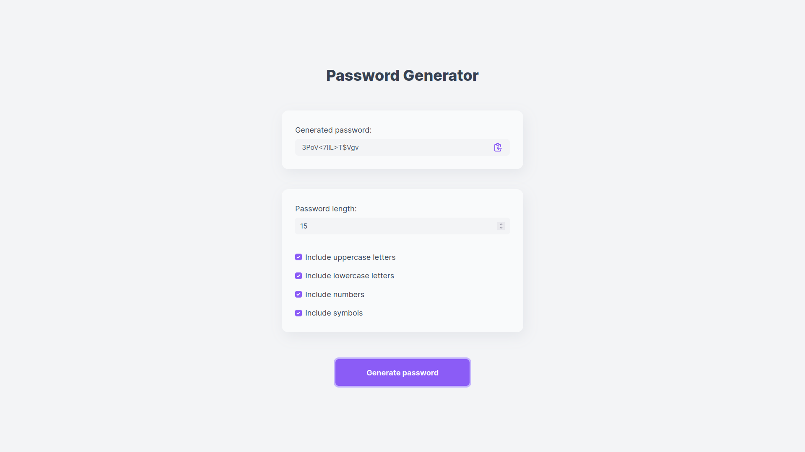

# Password Generator

A website for generating passwords that lets users pick the length (from 6-20)
of their password as well as the types of characters (uppercase letters,
lowercase letters, numbers and symbols) that should be in it. It also lets
users copy a generated password to the clipboard by clicking on it.

The project is
based on the requirements
[here](https://github.com/florinpop17/app-ideas/blob/master/Projects/2-Intermediate/Password-Generator.md).



See it live [here](https://react-passwd-gen.netlify.app/).

## Setup

First, clone this repo:

```bash
git clone https://github.com/thamika123/password-generator.git
```

Next, install all the necessary dependencies:

```bash
npm install
```

Finally, run Parcel:

```bash
npm run serve
```

Open your browser and navigate to `localhost:1234`.
